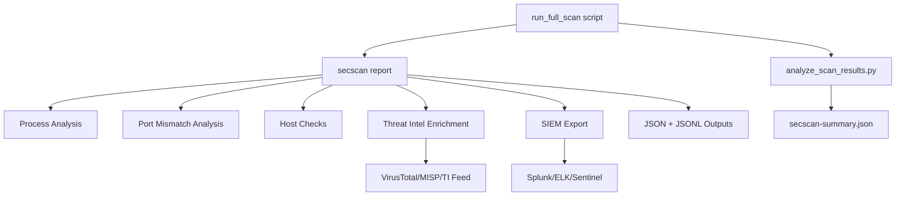
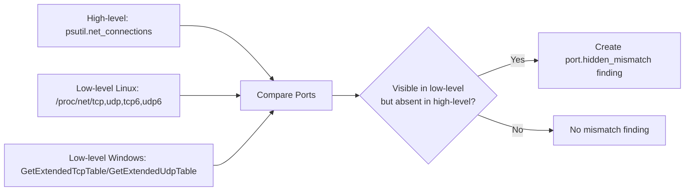
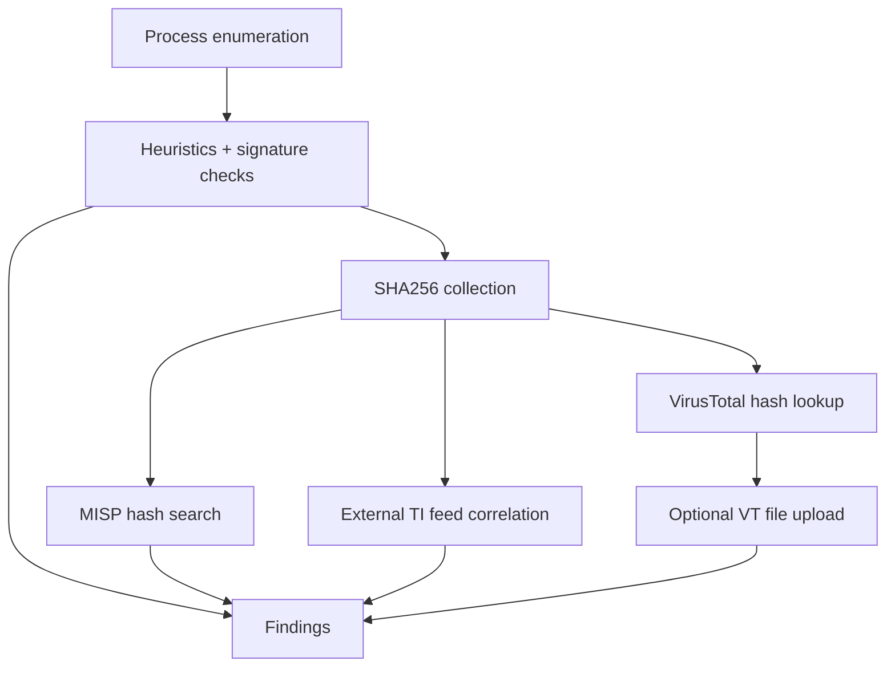

# Architecture and Execution Flow

## High-Level Flow

## Hidden Port Detection Model

## Process/TI Pipeline

## Run Artifacts

Each full run creates a dedicated folder:

`reports/<timestamp>/`

Files:

- `secscan-report.json`
- `secscan-findings.jsonl`
- `secscan-summary.json`
- `run.log` (Windows full script)
